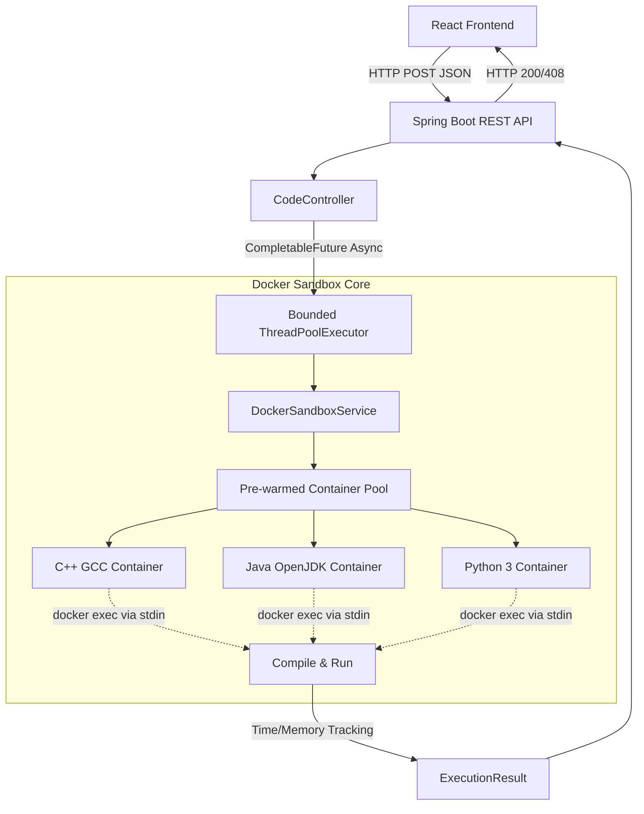

# CodeEngine 🚀

A high-performance, distributed code execution engine that securely compiles and runs untrusted C++, Java, and Python code in isolated Docker environments.

## 🏗 System Architecture



## 🛠 Tech Stack
- **Frontend:** React, Vite, Monaco Editor, TailwindCSS
- **Backend:** Java 21, Spring Boot, docker-java API
- **Infrastructure:** Docker, Docker Compose
- **Performance Tooling:** GNU `time` for memory profiling, Async Task Queues

## ⚡ Quick Start

### 1. Requirements
- Docker and Docker Compose installed
- Maven & Java 21

### 2. Start the Stack
Bring up the frontend and backend simultaneously using Docker Compose:
```bash
docker-compose up -d --build
```

*(Note: The `app` container mounts `/var/run/docker.sock` to seamlessly manage the pre-warmed sandbox containers on your host machine).*

### 3. Usage
Navigate to `http://localhost:8080` (or your mapped frontend port) to access the Code Editor, select your language, and run code instantly!

### 4. Running Benchmarks
To stress-test the async queue and warm pool performance:
```bash
python3 benchmark.py -c 20 -n 100 --all
```